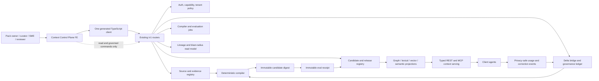

# Onto_Wiz Context Control Plane - Product Blueprint and Build Handoff

**Version:** 1.0  
**Date:** 2026-07-12  
**Status:** PLANNING BLUEPRINT - NOT AN IMPLEMENTATION-READY MINI-SPEC  
**Audience:** Integrator (INT), Backend/Factory (BE), Frontend (FE), Knowledge and Evaluation (KE), Security, and read-only Reviewer (REV)  
**Reference prototype:** `frontend/src/app/control-plane/` and `frontend/src/features/control-plane/`

---

## 1. Executive instruction

Use the control-plane prototype as an **executable product and acceptance reference** for
how users inspect, govern, evaluate, release, simulate, and improve a context layer.
Do not treat its mock API, TypeScript view models, fixture state, receipts, or client-side
workflow as production contracts or governed behavior.

The team must productionize this surface through the existing Onto_Wiz delivery units and
canonical runtime. It must not create a second control-plane backend, a second artifact
identity, a second lifecycle, or an alternate mutation path.

The governing rule is:

```text
prototype interaction
  -> existing canonical contract
  -> committed bounded mini-spec
  -> read-only spec review
  -> generated client + fixture handshake
  -> red-green implementation
  -> immutable review SHA + evidence
  -> INT integration
```

No implementation starts from this blueprint alone. INT must first map each accepted slice
to an existing backlog unit, or explicitly add a new unit and dependency edge to the
backlog. Every implementation unit remains at most one person-week.

---

## 2. Product outcome

The Context Control Plane is the operational product surface over the Onto_Wiz context
factory and serving plane. A pack owner, curator, reviewer, data steward, SME, or agent
builder must be able to answer five questions without inspecting storage or logs:

1. What governed context exists, for which client, market, audience, purpose, and time?
2. What source, evidence, human decision, and version supports each material artifact?
3. Is the current candidate safe and useful for its named agent workloads?
4. Why is a candidate blocked, stale, changed, released, withdrawn, or being served?
5. What observed failure or correction should become the next governed Delta and eval?

The product loop is:

```text
source -> candidate knowledge -> human decision -> candidate pack
       -> deterministic validation and evaluation -> release decision
       -> typed agent consumption -> usage/failure/correction
       -> proposed Delta + regression eval -> next candidate
```

The control plane manages this loop. It does not replace the compiler, registry, eval
runner, Delta bridge, source boundary, typed context API, or agent runtime.

---

## 3. Governing precedence

This blueprint supplements the existing engineering system and cannot relax it.

| Priority | Governing source | What it controls |
|---|---|---|
| 1 | Accepted ADRs and security decisions | Architecture and security boundaries |
| 2 | `docs/specs/BUILD_INSTRUCTION_SET_2026-07.md` | Engineering invariants, gates, contracts, and DoD |
| 3 | `docs/specs/DELIVERY_LOOPS_BACKLOG_2026-07.md` | Unit IDs, dependencies, status, ownership, and review isolation |
| 4 | `docs/specs/DOMAIN_PACK_PLATFORM_BUILD_INSTRUCTION_SET_2026-07.md` | Domain-pack compiler, artifact, evaluation, projection, and serving requirements |
| 5 | Latest accepted committed unit mini-spec | Frozen scope and acceptance for one build unit |
| 6 | This blueprint | Product intent and prototype-to-unit mapping |
| 7 | Prototype code and synthetic fixture | Interaction reference and deterministic test harness only |

If this document conflicts with a higher-priority source, stop and amend this document or
the relevant mini-spec before implementation.

---

## 4. What exists now

### 4.1 Prototype inventory

| Path | Current purpose | Production disposition |
|---|---|---|
| `frontend/src/app/control-plane/page.tsx` | Isolated route and metadata | Reusable as a thin route after D1 app-shell alignment |
| `frontend/src/features/control-plane/ContextControlPlane.tsx` | Session workflow and screen orchestration | Reuse interaction structure; replace authoritative local state |
| `frontend/src/features/control-plane/components/` | Command, knowledge, eval, simulator, and release views | Reuse selectively after D0/D1 review and generated-client wiring |
| `frontend/src/features/control-plane/api.ts` | Feature-local HTTP seam | Preserve the interface seam; replace handwritten contracts with generated client |
| `frontend/src/features/control-plane/types.ts` | Prototype view models | Keep as view models only; do not promote to canonical spec without review |
| `frontend/src/features/control-plane/mock-data.ts` | Deterministic Auravia UI fixture | Retain as explicitly synthetic CI/demo fixture |
| `frontend/src/features/control-plane/mock-server.ts` | Deterministic simulated decisions and receipts | Never use as production governance or serving logic |
| `frontend/src/app/api/control-plane/v1/` | Simulated read endpoints | Remove or feature-gate when live generated client is wired |
| `frontend/src/app/api/control-plane/%5Fsim/` | Simulated actions and agent runs | Must be absent or return 404 in every production deployment |
| `frontend/src/features/control-plane/*.test.*` | Interaction and deterministic behavior tests | Retain as reference tests; add live contract and browser tests |
| `frontend/src/features/control-plane/control-plane.module.css` | Route-scoped operational design | Reconcile with accepted D0 tokens without global overrides |

### 4.2 Verified reference story

The prototype currently demonstrates this synthetic story:

1. `0.1.1-rc1` starts at 27/28 golden cases with one critical failure.
2. `eval_missing_timepoint_block` traces the failure to
   `claim_variant_easi75_us_hcp_v1` and its missing `timepoint_week_16` invariant.
3. The content agent abstains while the critical candidate gate is open.
4. A simulated Delta restores the invariant and produces a 28/28 rc2 result.
5. A simulated scoped MLR decision closes the remaining demo blocker.
6. The candidate publishes only to a demo channel; production remains disabled.
7. The simulator compares governed and ungoverned behavior for content, MLR, brand
   analytics, and omnichannel workloads.
8. Simulator feedback creates a proposed improvement Delta and does not mutate a release.

This is the mandatory vertical acceptance spine. Production completion requires the same
story against persisted canonical records, real authorization, real jobs, and a real
agent call - not the current mocks.

### 4.3 Current verification baseline

At handoff, the isolated prototype has passed:

- frontend typecheck and lint;
- 81 frontend tests, including 8 control-plane-specific tests;
- Next.js production build with all four prototype API routes present;
- API smoke checks for snapshot, artifact detail, simulated action, and simulation;
- desktop visual inspection; and
- a true 390 x 844 browser geometry audit with document width 390, no escaping elements,
  stacked health tiles, bounded search, and only intended internal rails scrolling.

This evidence proves the prototype works locally. It does not prove production readiness.

---

## 5. Production blockers in the prototype

The following are deliberate prototype shortcuts. None may cross a client or production
boundary.

| Severity | Prototype shortcut | Required production resolution | Existing unit family |
|---|---|---|---|
| P0 | No authenticated principal, capability, ownership, or tenant check | JWT/capability and resource ownership enforced server-side | F0.3A/B, E8 |
| P0 | Actions are stateless receipts and workflow state lives in React | Persistent Delta/review/job/release state with transactions and audit | F0.2H, F0.3C, F0.6A |
| P0 | Client supplies `candidateQualified` to the simulator | Server selects and verifies candidate/release and receipt | F0.6A/B, E4.3/4 |
| P0 | `/_sim/v1` routes are present in a normal Next build | Build/deployment gate makes simulator routes unavailable in production | F0.8A, D1.2 |
| P0 | No compiler, registry, validator, eval runner, or release registry is called | Wire to canonical jobs, candidate digest, receipt, attestation, and registry | F0.6A/B, E3.6, E4.1-4 |
| P0 | Synthetic production block is represented by fixture metadata | Runtime and registry structurally reject synthetic production publication and serving | F0.6A, E4.2/3 |
| P1 | Artifact, source, staleness, and metrics are hard-coded | Load canonical persisted records and derived read models | E1.1, E3.1/5, D1.2 |
| P1 | API response types are handwritten and cast at runtime | OpenAPI-first contract, generated TS client, stable errors, contract tests | F0.3A/D |
| P1 | Simulator scenarios import fixture data directly | Scenario and operation catalog comes through an accepted client contract | E4.4 |
| P1 | Eval is synchronous UI state, not an immutable job/receipt | Bounded async job with retry, progress, cancellation policy, and receipt | F0.6B, E3.6, E4.2 |
| P1 | No source access, provider-egress, retention, or deletion enforcement | Enforce source policy through source, projection, and serving layers | E1.1, E8 |
| P1 | No tamper, withdrawal, restore, or restart proof | Add digest, invalidation, backup/restore, and withdrawal tests | F0.8A, E4.3 |
| P1 | Control-plane files are outside the current coverage include list | Add shipped feature paths to >=85% blocking coverage and browser paths | D1.2 |
| P1 | Role selector changes presentation only | Derive available operations from server capabilities; server remains authoritative | F0.3A/B, D1.1/2 |
| P1 | Prototype types introduce a parallel lifecycle vocabulary | Rebase state and transitions onto canonical `ontowiz-spec` lifecycle contracts; keep feature types as presentation-only view models | F0.3A/D, D1.2 |
| P1 | Route-local CSS and status components duplicate accepted UI foundations | Rebase incrementally onto reviewed `frontend/src/ui` tokens and primitives without changing the proven workflow | D0, D1.2 |

The phrase "production build" in local Next.js evidence means only an optimized frontend
build. It does not mean that the product, data, controls, or content are production-ready.

---

## 6. Non-negotiable invariants

Every control-plane unit must preserve these invariants:

1. Every governed artifact has one canonical identity.
2. Content identity and source-instance identity remain separate.
3. Material claims, rules, metrics, joins, and decisions resolve to exact provenance.
4. Missing applicability never means globally permitted.
5. LLM and parser output is a candidate, never authority or approval.
6. Every mutation goes through one persistent Delta and canonical bridge path.
7. Dissent and contested state are durable; consensus cannot erase them.
8. Candidate compilation, evaluation, publication, and serving are distinct transitions.
9. Evaluation cannot modify candidate bytes and is bound to the candidate digest.
10. Failed, unrun, changed, stale-critical, withdrawn, or tampered candidates cannot publish
    or production-serve.
11. Aggregate scores cannot hide a critical compliance, privacy, tenancy, provenance,
    numeric, or causal failure.
12. Embeddings, lexical indexes, graphs, catalogs, and context files are projections and
    never canonical truth.
13. Agents and the simulator call typed context contracts, never storage directly.
14. Source access, tenant, retention, withdrawal, and deletion propagate to projections.
15. Every accepted correction produces a Delta and a regression eval.
16. Synthetic content is structurally unable to reach production.
17. The platform must not hard-code Auravia, pharma marketing, or one client's policy.
18. UI visibility and disabled buttons never substitute for server authorization.
19. Policy-defined separation of duties is enforced server-side; authors, proposers,
    reviewers, MLR authorities, and release authorities remain distinct where required.

---

## 7. Target architecture



### Architectural instruction

- The frontend composes view models from accepted production contracts.
- BE owns OpenAPI, generated client, fixtures, persistence, authorization, and final wiring.
- KE owns semantic profiles, evidence policy, eval definitions, and synthetic reference data.
- The existing `/v1/auth`, `/v1/deltas`, `/v1/jobs`, `/v1/ontology`, `/v1/intake`,
  `/v1/packs`, `/v1/usage`, `/v1/corrections`, `/v1/context`, and MCP surfaces remain
  the master route families.
- Do not create a parallel `/v1/control-plane` backend family merely because the prototype
  has `/api/control-plane`. A read aggregation endpoint requires a mini-spec, measured need,
  and no duplicated authority.
- Public serving stays key-free. Model calls remain confined to accepted offline/intake
  workers and never enter the dashboard, release, or context-read hot path.

---

## 8. Ownership and isolation

| Lane | Owns for this product | Must not own |
|---|---|---|
| FE | Route, responsive views, view-state composition, accessibility, browser tests | Endpoint shapes, lifecycle authority, persistence, direct corpus writes |
| BE | OpenAPI, generated client, auth, persistence, jobs, compiler/eval/release APIs | Product UI decisions or self-review |
| KE | Artifact profiles, evidence rules, evaluation cases, failure taxonomy, SME protocol | Runtime bypass, deployment, or declaring generated content approved |
| INT | Baseline SHA, approved unit mapping, merge order, feature flags, deployment, status | Building and approving the same submitted SHA |
| REV | Detached read-only review, findings, reproduction, residual risk, verdict | Editing, committing, pushing, merging, or changing status |

### Required repository boundaries

1. Platform runtime and contracts remain in their accepted `packages/` ownership paths.
2. Product UI stays under `frontend/`.
3. Synthetic reference packs remain explicit fixtures/examples, never client truth.
4. Client pack workspaces, access policy, and source content do not leak into platform code.
5. Derived projection stores can be replaced without changing agent or UI contracts.
6. Any future multi-repo split must preserve immutable pack/version/digest contracts; it is
   not a reason to fork the semantic kernel or control-plane UI per client.

### 8.1 First-client deployment position

Follow ADR-019 and `PLATFORM_BASELINE_STRUCTURE_2026-07.md`: the pharma default is an
Onto_Wiz-managed, client-isolated VPC deployment, unless the client's approved architecture
requires client-hosted/on-prem. Preserve three independently deployable planes:

| Plane | Responsibility | Hard boundary |
|---|---|---|
| Control | catalog, governance, curation, eval metadata, release authorization, admin | Does not hold model credentials or serve agent traffic directly |
| Build | controlled source access, parsing, compile, projection build, evaluation | May create candidates and receipts; cannot activate a release |
| Data | per-client, key-free projections and typed context serving | May serve only verified releases; cannot mutate governance |

For the first client, isolate the database, object storage, pack/registry namespace,
lexical/vector/graph projections, encryption keys, backups, logs, and runtime identity.
Contracts must still carry server-derived tenant and release scope so later deployment modes
do not require a semantic rewrite. Signing establishes integrity and authorship, not
confidentiality. Client content and overlays remain outside platform-core Git history.

---

## 9. Screen-to-contract map

The table below is the production handoff map. Exact endpoint shapes are finalized only in
the accepted unit mini-spec and master OpenAPI.

| Product surface | Canonical records/capabilities | Existing units |
|---|---|---|
| Command Center | authenticated principal, pack summary, candidate/release state, eval receipt, stale dependency summary, jobs, usage | F0.3A/D, D1.2, F0.6A/B, E3.6 |
| Knowledge Workbench | artifact versions, applicability, provenance, relationships, source spans, lineage, consumers | E1.1, E3.1, E3.5, F0.7A |
| Source Registry | source manifest, access class, immutable instance, parser job, chunks, locators, quarantine | F0.4A/B, E1.1, E1.3 |
| Review and SME Queue | Delta revisions, evidence, dissent, reason-coded decision, dry-run, escalation, attribution | F0.2H, F0.3B/C, E2.1, E3.1 |
| Evaluation Center | candidate digest, job state, case result, criticality, failure trace, immutable receipt | F0.6A/B, E3.6, E4.2 |
| Staleness and impact | source/evidence expiry, dependency graph, invalidated projections, consumer impact, remediation job | E3.5/6, E6.1/2 |
| Release Center | manifest, layer pins, semantic diff, gate results, review decisions, attestation, rollback/withdrawal | E4.1/2/3 |
| Agent Simulator | typed `/v1/context` and MCP operations, trust envelope, safe trace, current/candidate comparison | E4.4, E6.1 |
| Improvement Delta | typed usage/failure/correction event, proposed Delta, regression case, shipped-impact link | E6.1/2 |

---

## 10. Build sequence mapped to the accepted backlog

These are product slices, not new unit IDs. INT must allocate each slice to an existing
unit or formally create a bounded unit in the dependency graph.

### Slice A - Freeze and register the reference prototype

**Maps to:** INT change control and D1.2 planning  
**Owner:** INT with FE evidence support

Steps:

1. Stage only the control-plane prototype paths; exclude active D0 and unrelated worktree
   changes.
2. Record an immutable prototype SHA and exact changed-file inventory.
3. Record current screenshots, browser geometry, tests, build output, API transcripts, and
   known limitations from section 5.
4. Mark the SHA as a reference fixture, not a verified production unit.
5. Decide whether the prototype remains on its isolated route until D1.1 app-shell work is
   accepted.

DoD:

- The team can check out one immutable reference SHA.
- No active D0/BE/KE lane file is swept into the reference commit.
- Every mock, synthetic record, and production blocker is visibly labelled.
- INT maps the next slice to an accepted unit before work begins.

### Slice B - Contract handshake and live read-only shell

**Maps to:** F0.3A, F0.3D, D1.1, D1.2  
**Owners:** BE contract first; FE consumes generated client

Steps:

1. Map every command-center field to a canonical persisted source and authority.
2. Merge accepted OpenAPI, generated TypeScript client, stable error model, and realistic
   fixture pack before FE implementation.
3. Replace prototype snapshot fetches with generated-client calls.
4. Implement authenticated loading, empty, partial, stale, permission-denied, retry, and
   unavailable states.
5. Remove fake counts where the backend cannot yet provide validated measures; show
   `not measured` rather than zero or fabricated percentages.
6. Keep all mutation buttons absent or disabled behind capability and feature gates.

DoD:

- Named authenticated user sees only owned packs and allowed capabilities.
- Read data survives restart and matches direct API queries.
- FE has no handwritten production response type or direct fetch outside the generated
  client seam.
- Contract fixtures and live implementation pass the same tests.
- Dashboard metrics name definition, denominator, clock, and data status.

### Slice C - Artifact, source, evidence, and lineage inspection

**Maps to:** F0.4A/B, E1.1, E3.1, E3.5, F0.7A  
**Owners:** BE/KE contract and data; FE workbench

Steps:

1. Serve artifact summary and detail using canonical IDs and versions.
2. Resolve each material assertion to immutable source instance and exact locator/span.
3. Enforce source access and tenant policy before returning evidence text.
4. Add applicability, contradictions, required risk, relationships, dependants, and
   affected agent contracts.
5. Build one lineage query from source/span through run, Delta, artifact, candidate,
   release, eval, usage, and correction.
6. Implement source quarantine and withdrawn/stale presentation without exposing unsafe
   content as executable instruction.

DoD:

- A user answers who, source, scope, decision, pack, eval, and consumer in one screen.
- An inaccessible evidence source returns a stable denied state, not an empty citation.
- Cross-tenant artifact and evidence requests fail server-side and are audited.
- Broken references, expired policy, missing scope, and cycles have negative tests.
- The inspector never treats embeddings or graph projection as canonical evidence.

### Slice D - Governed review and correction

**Maps to:** F0.2H, F0.3B/C, E3.1, E3.2  
**Owners:** BE governance; KE decision protocol; FE review experience

Steps:

1. Replace `apply_eval_correction` and `approve_risk_bundle` simulation actions with typed
   Delta proposal and reason-coded review decisions.
2. Require principal, capability, ownership, `Idempotency-Key`, expected version/ETag,
   scope, rationale bounds, and audit receipt on every mutation.
3. Preserve APPROVE_FOR_SCOPE, RETURN_WITH_FINDINGS, REJECT, ESCALATE, WITHDRAW, and
   dissent as distinct durable decisions.
4. Make correction edit/resubmit create a new immutable revision rather than overwrite.
5. Use outbox/job state for compile-on-approve; do not run compiler work inside the
   transaction or browser request.
6. Test double-submit, conflicting key/hash, concurrent reviewers, restart, retry, and
   stale expected version.

DoD:

- There is no alternate ACTIVE write path.
- Double/concurrent decision is deterministic and audited.
- A browser refresh and service restart preserve decision, revision, actor, and job.
- FE role visibility does not bypass a server authorization negative.
- A correction creates both a proposed artifact Delta and linked regression-eval intent.

### Slice E - Real candidate, evaluation, and failure trace

**Maps to:** F0.6A/B, E3.6, E4.2  
**Owners:** BE/KE eval pipeline; FE Evaluation Center

Steps:

1. Compile an immutable candidate with exact inventory, pins, digest, and explicit
   non-production status.
2. Run evaluation as a bounded, replayable job with visible progress and stable failure.
3. Store immutable case results and receipt tied to the unchanged candidate digest.
4. Separate development, regression, SME-authored, and held-out cases with honest
   provenance and leakage checks.
5. Show critical cases separately and prevent aggregation from hiding failure.
6. Expose input, expected result, actual result, failure code, artifact/rule trace, owner,
   correction Delta, and replay history.
7. Add timeout, retry, cancellation policy, restart, and partial-result behavior.

DoD:

- The Auravia rc1 timepoint regression fails for the exact expected reason.
- Restoring `timepoint_week_16` through the governed Delta path creates a new candidate;
  evaluation of that unchanged digest passes 28/28 reference cases.
- A changed candidate after evaluation cannot reuse the receipt.
- Independent replay produces the same deterministic case results and receipt inputs.
- Reference cases are never described as externally validated or SME-held-out unless true.

### Slice F - Staleness and blast-radius control

**Maps to:** E3.5, E3.6, E6.1/2  
**Owners:** BE dependency/invalidation; KE policy; FE impact view

Steps:

1. Define staleness triggers for source replacement/withdrawal, label or policy change,
   evidence contradiction, review expiry, metric/schema/join change, access revocation, and
   base-layer upgrade.
2. Propagate state to claims, risk bundles, briefs, evals, releases, projections, and agent
   consumers using stable IDs.
3. Apply fail-closed behavior to critical safety, scope, access, and tenant changes.
4. Record propagation input, policy, impacted inventory, serving decision, jobs, and
   receipt.
5. Provide acknowledge, replace evidence, reconfirm scope, withdraw, route for review,
   recompile, and rerun operations through governed contracts.

DoD:

- A label/source change yields a reproducible dependency and projection invalidation set.
- No withdrawn source remains retrievable from lexical, vector, graph, catalog, or context
  projections.
- Current and future serving behavior is explicit for every affected artifact.
- Blast-radius computation is bounded, timed, and negative-tested.

### Slice G - Gated composition, publication, and attestation

**Maps to:** E4.1, E4.2, E4.3  
**Owners:** BE/KE release integrity; FE Release Center

Steps:

1. Compose by stable nodes, layers, functions, dependency pins, and explicit exclusions.
2. Show semantic diff, inherited/overridden items, unresolved conflicts, footprint, and
   invalidated evals before candidate build.
3. Make publish require authorized principal, passing matching receipt, unchanged digest,
   current decisions, staleness policy, isolation checks, and rollback target.
4. Emit release attestation with digest, source commit, compiler/schema/model versions,
   eval-receipt hash, access class, and compatibility.
5. Implement idempotent publish, withdrawal, deprecation, rollback, tamper, and TOCTOU
   tests.
6. Structurally reject the Auravia synthetic fixture for production while allowing its
   explicitly named reference/demo channel.

DoD:

- Failed, unrun, changed, stale-critical, unauthorized, synthetic, withdrawn, and tampered
  candidates cannot production-publish or serve.
- Same manifest and pins reproduce the same candidate digest.
- Passing unchanged candidate publishes once and is addressable by exact version/digest.
- Rollback and withdrawal are demonstrated after restart.
- UI cannot override or manufacture the gate state.

### Slice H - Typed agent simulator and consumption trace

**Maps to:** E4.4 and E6.1  
**Owners:** BE typed serving; KE workload contracts; FE simulator

Steps:

1. Replace `mock-server.ts` decisions with calls to accepted `/v1/context` and MCP
   operations using exact released or diagnostic-candidate selection policy.
2. Return decision, limitations, artifact IDs/versions, evidence spans, metric/query
   receipts, policy/label versions, release/attestation, access decision, and human-review
   requirement in a trust envelope.
3. Distinguish governed BLOCK/ABSTAIN/ROUTE outcomes from HTTP/auth/infrastructure errors.
4. Permit candidate comparison only in an authorized diagnostic environment; never make
   candidate state available to normal production agents.
5. Record safe traces without raw prompt, source, identity, patient, or customer text by
   default.
6. Support content, MLR preflight, brand diagnosis, and omnichannel next-action workloads.

DoD:

- Real agent consumption cites an exact released artifact and receipt.
- REST and MCP produce the same eligibility decision for the same request.
- Simulator cannot select a release by asserting `candidateQualified` from the client.
- Cross-client, missing consent, stale context, prompt injection, warehouse timeout,
  withdrawn release, and rate-limit cases have explicit outcomes.
- A/B comparison is labelled diagnostic and never presented as external lift evidence.

### Slice I - Correction reuse and compounding

**Maps to:** E6.1 and E6.2  
**Owners:** BE event/Delta pipeline; KE evaluation; FE impact and SME surfaces

Steps:

1. Capture privacy-safe usage, abstention, failure, correction, and low-confidence events
   tied to tenant, agent, task, pack version, artifact IDs, result class, and trace ID.
2. Convert accepted feedback to a proposed Delta plus regression case; never mutate a
   candidate or release directly.
3. Route through normal review, compile, evaluate, and publish transitions.
4. Link the contributor and correction to the future release and recurrence outcome.
5. Enforce retention, deletion, source sensitivity, ownership, and egress policy.

DoD:

- One real agent failure completes the full return loop to a later released correction.
- Deleted/restricted data does not persist in telemetry or derived feedback artifacts.
- Reuse and recurrence metrics have documented denominators and are not gamed by volume.
- No feedback event creates an ACTIVE artifact outside the Delta bridge.

### Slice J - Second-consumer enterprise hardening

**Maps to:** E8 only after its evidence gate  
**Owners:** INT/BE/Security with FE/KE consumers

Do not start because the control-plane prototype exists. Start only when the accepted
second-consumer/tenant gate is met.

Required outcomes include tenant isolation across every projection, configurable
retention/deletion, client-specific access and egress policy, deployment/restore evidence,
license/IP inventory, client overlay separation, and compatibility across at least two
genuinely different packs. Platform IP and client-owned source/domain content must remain
separable in repository, artifact, deployment, backup, export, and deletion paths.

---

## 11. Parallel delivery rule

Within an accepted slice, the team may parallelize only after the contract handshake:

```text
BE: OpenAPI + generated client + fixtures -----+
                                                 +-> final live wiring owned by BE
FE: screens against generated fixture client --+
KE: artifact/eval fixtures and failure cases ---+
```

Rules:

1. BE merges contract, generated client, and realistic fixtures first.
2. FE does not invent endpoints, errors, lifecycle, or response types.
3. KE fixtures include positive, negative, near-miss, critical, and wrong-scope cases.
4. Fixture-client tests must also run against the live implementation.
5. A loop closes only on the live URL without mock routes or client-side authoritative
   state.

---

## 12. Mandatory end-to-end acceptance scenarios

The synthetic Auravia pack remains the repeatable platform exam. Client-specific packs add
their own tests; they do not replace these leak and gate cases.

### AC-01 - Initial blocked candidate

- Load persisted `0.1.1-rc1` for the synthetic reference pack.
- Show 27/28 reference cases and one separately visible critical failure.
- Content draft operation against this diagnostic candidate returns governed abstention.
- Production publish and serving reject it.

### AC-02 - Exact claim and evidence inspection

- Open `claim_auravia_easi75_week16`.
- Show proposition, population, endpoint, 62% vs 28% placebo, week 16, scope, required
  risk, prohibited transformations, source versions, and exact spans.
- Deny the span to a principal without source access while preserving a non-sensitive
  artifact-level explanation.

### AC-03 - Governed correction

- Trace `eval_missing_timepoint_block` to the candidate variant.
- Submit a scoped Delta restoring `timepoint_week_16` with expected version and idempotency.
- Persist actor, evidence, rationale, revision, dissent, audit, and compile job.
- Refresh and restart without losing state.

### AC-04 - Evaluation and demo release

- Compile a new immutable candidate.
- Replay the affected and full reference suites to 28/28.
- Record the authorized scoped risk-bundle decision.
- Publish once to the reference/demo channel with attestation and rollback target.
- Reject production because the fixture is synthetic, even though all reference cases pass.

### AC-05 - Content generation

- US HCP evaluation email preserves population, week 16, comparator, fictional status,
  required risk, sources, release ID, and `DRAFT_REQUIRES_HUMAN_MLR`.
- GB public branded request blocks without returning a draft.

### AC-06 - MLR preflight

- "Superior, side-effect-free choice" returns critical superiority, safety-minimization,
  and missing-risk findings.
- Automated preflight never returns MLR approval.

### AC-07 - Brand analytics

- Return NBRx 920 vs plan 1,000, -80/-8.0%.
- Return active writers +2.8%, writer depth -10.1%, paid-claim rate 67% vs 74%, stable
  reach at 68%, email proxy 21% vs 20%, completeness 98.7%, and shortfall concentration
  75% in two synthetic plans.
- Report access friction as a hypothesis for investigation and email causality as unresolved
  because no controlled experiment exists.
- Attach metric versions, formula/grain, snapshot, quality state, and query receipt.

### AC-08 - Omnichannel next action

- With two valid email deliveries in 14 days, exclude email with policy reason.
- Independently evaluate field and approved-web options.
- Propose field follow-up for human workflow; do not silently substitute or auto-execute.

### AC-09 - Security and integrity negatives

- Deny cross-client ID lookup, search, graph traversal, vector retrieval, source, trace,
  export, async-job, REST, MCP, and release access without revealing object existence.
- Treat instructions in an uploaded transcript as source content, not executable direction.
- Reject missing consent/suppression authority, fan-out joins, stale evidence, tampered
  candidate, unknown schema, withdrawn source, and held-out leakage.

### AC-10 - Compounding correction

- Capture a real monitored agent failure without raw sensitive text.
- Create proposed Delta and regression case.
- Route through review, build, eval, and next release.
- Show shipped impact and recurrence without auto-promotion.

### AC-11 - SME disagreement and responsible contribution

- Two authorized SMEs submit conflicting, evidence-backed decisions on the same revision.
- Preserve both decisions and dissent, block automatic resolution, and route to the named
  authority for that scope.
- Attribute later impact to accepted evidence/correction quality, not approval volume or
  speed; contribution score cannot grant MLR, release, or access authority.

### AC-12 - Claim eligibility versus asset review

- Place an individually eligible claim into a synthetic asset whose prominence,
  juxtaposition, or overall impression is misleading.
- Keep claim/rule preflight and whole-asset human review as distinct states.
- Block asset approval and release even though the underlying claim remains eligible for
  its narrower governed scope.

### AC-13 - Failure, retry, and recovery

- Interrupt a decision, compile job, and release promotion at their transaction boundaries.
- Retry with the same idempotency keys, restart all three planes, and perform a restore
  smoke test.
- Prove exactly one decision and release, no partial activation, a usable previous release,
  and verifiable immutable receipts after recovery.

---

## 13. SME curation and responsible gamification

The control plane should make expert contribution frequent, bounded, and useful without
turning authority into a score.

### 13.1 SME task types

- confirm or correct an evidence span;
- resolve concept/entity mapping;
- validate market, audience, purpose, channel, and temporal scope;
- review required risk or contraindicating evidence;
- resolve contradiction or record durable dissent;
- validate metric formula, grain, denominator, allowed dimensions, and interpretation;
- author a counterexample or regression case;
- review a candidate answer/asset; and
- confirm that a stale dependency remains applicable or requires withdrawal.

### 13.2 Contribution measures

Allowed measures:

- accepted evidence-backed corrections;
- counterexamples that catch future regressions;
- downstream reuse across packs or agents;
- recurrence reduction;
- review agreement and calibration with later adjudication;
- high-impact stale dependencies resolved; and
- median response time by task class, with complexity and abstention visible.

Forbidden scoring:

- approval volume;
- fastest MLR decisions;
- raw number of artifacts created;
- automatic authority or promotion based on points;
- hidden penalties for dissent, escalation, or correct abstention; and
- leaderboards across incomparable roles, markets, or complexity.

Public leaderboards are off by default. Contribution analytics are access-controlled and
role-comparable; they inform coaching and task routing, never authority.

### 13.3 SME DoD

- Every task names scope, evidence, authority, expected decision, impact, and downstream
  release/eval consequence.
- Completion creates a typed decision or Delta revision, not free-text-only feedback.
- Contributor impact links to accepted correction and shipped outcome.
- Regulatory/MLR authority comes from role and policy, never reputation points.
- SMEs can see why their contribution was accepted, superseded, contested, or rejected.

---

## 14. Evaluation instructions

1. Route cases by failure mode: correctness, scope, risk, access, data, join, numeric,
   causal, staleness, security, and operational failure.
2. Keep deterministic structured checks separate from model-judged or human-judged cases.
3. Keep development, regression, SME-authored, and held-out partitions explicit.
4. Hash/freeze held-out partitions and prevent answers from entering context or fixtures.
5. Record author/provenance; never call generated or developer-authored tests SME-held-out.
6. Report counts, critical failures, uncertainty, configuration, and limitations beside
   any aggregate score or A/B result.
7. Bind every receipt to exact candidate digest, compiler/schema versions, operation,
   fixture/data snapshot, and runner version.
8. Any accepted material correction adds at least one regression case.
9. Critical failure is release-blocking regardless of aggregate pass rate.
10. The current 28 Auravia cases are synthetic reference gates, not external validation.

---

## 15. Security, tenant, privacy, and IP requirements

### 15.1 Authorization and tenancy

- Every read and mutation derives tenant and principal from authenticated server context.
- Caller-supplied tenant, role, release-qualified, or ownership flags are untrusted.
- Capability, resource ownership, source access, and pack scope are checked server-side.
- Configured maker-checker and separation-of-duty rules prevent a proposer from supplying
  an independent review or release decision; claim, asset, and release decisions are distinct.
- Tenant isolation tests cover canonical DB, cache, job, graph, lexical/vector projection,
  trace, backup, export, and deletion paths.

### 15.2 Mutation integrity

- Require `Idempotency-Key`, request hash, expected version/ETag, bounded reason/rationale,
  principal, timestamp, and append-only audit.
- Replay returns the original outcome; same key with different request conflicts.
- No source text, identity, patient-level row, secret, model key, or raw prompt appears in
  logs or error bodies.

### 15.3 Source and model egress

- Source access class controls viewing, extraction, model-provider egress, projection,
  retention, deletion, and export.
- Prompt-injection text from documents remains inert content.
- Public serve roles remain model-key-free and source-text-minimized.

### 15.4 IP and client deployment

- Platform kernel, compiler, control plane, SDK, eval framework, and generic profiles are
  platform IP.
- Client sources, decisions, mappings, policies, overlays, and pack artifacts remain
  separately identifiable and governed according to contract.
- Do not copy client facts into platform fixtures or core code.
- Deliver deployments through versioned application images plus separately versioned pack
  artifacts/manifests; preserve compatibility and rollback contracts.
- Multi-tenant or sealed/encrypted enterprise overlays remain E8 work and do not bypass
  the second-consumer gate.

---

## 16. Frontend product requirements

1. Preserve the five primary views: Command Center, Knowledge, Evaluations, Simulator,
   and Release Center. Add Source/Review/SME surfaces through accepted slices, not one
   oversized page.
2. Maintain a quiet operational design optimized for scanning, comparison, traceability,
   and repeated action.
3. Use accepted D0 tokens and primitives after their reviewed SHAs; route-scoped prototype
   CSS must not establish a second global design system.
4. Show icon plus text for lifecycle/gate states; color alone is insufficient.
5. Implement keyboard navigation, focus order/return, semantic tables/trees, accessible
   dialogs, status announcements, and WCAG 2.2 AA target.
6. Verify 360, 768, and 1440 widths with no document overflow, clipped text, overlap, or
   inaccessible horizontal content.
7. Implement loading, empty, partial, stale, retry, denied, conflict, concurrent-action,
   offline, and job-failure states.
8. Derive capability presentation from server contracts; still expect server denial.
9. Production code imports no `mock-data`, `mock-server`, or `/_sim` route.
10. Use one generated client and one auth/session seam.
11. Use explicit labels: candidate, reference, synthetic, provisional, internal eval,
    demo released, production released, withdrawn, or not measured.
12. Preserve deep-linkable pack, artifact, eval case, job, trace, and release state where
    access policy allows.

---

## 17. Operational requirements

Every mini-spec must pin realistic dataset size and performance/resource budgets for its
hot paths. At minimum, measure and report:

- first useful render and dashboard read latency;
- catalog search and artifact/evidence detail latency;
- lineage and blast-radius latency and bounds;
- compiler/eval job duration, queue delay, timeout, retry, and cost;
- typed context operation latency and payload/token footprint;
- error, denial, abstention, retry, and stale-rate by operation;
- projection rebuild and withdrawal propagation time; and
- backup, restore, rollback, and restart recovery time.

Jobs require durable state, correlation ID, safe logs, retry policy, idempotency, and an
operator-visible terminal failure. Worker failure must not break read serving. Deployment
must expose health/readiness, persistent storage, secrets separation, restore smoke, and a
named runbook owner before a live environment is VERIFIED.

---

## 18. Mini-spec and review protocol

### 18.1 Definition of Ready

For each bounded slice, the committed mini-spec must contain:

1. immutable baseline and review SHAs;
2. objective and named consumer;
3. exact in-scope and out-of-scope behavior;
4. allowed files/packages and lane ownership;
5. accepted contract/dependency versions;
6. typed inputs, outputs, errors, identity, and lifecycle;
7. persistence, transaction, idempotency, and concurrency behavior;
8. authorization, tenant, privacy, retention, deletion, and egress behavior;
9. deterministic/non-deterministic boundary;
10. positive, negative, near-miss, migration, rollback, restart, and packaging tests;
11. eval cases and critical gate behavior;
12. evidence-bundle requirements;
13. performance/resource limits;
14. compatibility and migration position;
15. kill criteria and explicitly deferred work; and
16. objective unit DoD.

An uncommitted spec is not submitted. A material scope change after READY requires a
committed amendment and a new read-only review before implementation continues.

### 18.2 Execution and review isolation

1. INT publishes the pinned baseline and assigns one bounded accepted unit.
2. Builder commits the mini-spec on `build/<unit-id>-<short-name>`.
3. REV reviews that immutable spec SHA in a detached read-only worktree.
4. REV returns `READY` or findings; REV does not patch builder work.
5. Builder closes findings in a new commit and resubmits.
6. After READY, builder implements red-green within accepted paths.
7. Builder submits one immutable review SHA and evidence bundle.
8. REV returns `PASS`, `PASS WITH ACCEPTED P2`, or `CHANGES REQUIRED`.
9. Any code change invalidates the verdict and requires a new review.
10. INT alone integrates and marks VERIFIED.

### 18.3 Required evidence bundle

The bundle includes:

1. accepted mini-spec SHA, baseline SHA, review SHA, and exact changed-file list;
2. acceptance-to-test map plus targeted/full/coverage/static/build/packaging/migration
   results as applicable;
3. OpenAPI, generated-client, schema, and migration diffs;
4. generated candidate, manifest, projection, semantic diff, and eval receipt as applicable;
5. authorization, tenant, privacy, tamper, failure, concurrency, restart, and rollback
   evidence; and
6. deterministic rebuild, restore, withdrawal/invalidation proof, performance, browser
   screenshots, curl/MCP transcript, known limitations, and unrelated-change exclusion.

FE evidence specifically includes typecheck, lint, build, Vitest coverage, keyboard and
accessibility checks, 360/768/1440 screenshots, and the relevant browser path. A loop closes
only on a live URL without mock routes.

---

## 19. Final Context Control Plane Definition of Done

The product is not complete until all applicable items are VERIFIED at integrated SHAs:

1. Every visible field and action resolves to a canonical record and named authority.
2. Named authenticated users see and mutate only allowed tenant resources.
3. Material artifacts resolve to evidence, applicability, decision, version, eval, and
   affected agent consumers.
4. One persistent Delta path governs every correction and review transition.
5. Candidate, eval receipt, release, attestation, and serving gates are impossible to
   bypass through UI, API, path knowledge, retry, concurrency, or restart.
6. Synthetic, failed, unrun, stale-critical, changed, withdrawn, unknown, and tampered
   candidates cannot production-publish or serve.
7. Source withdrawal/deletion propagates through every projection and cache.
8. A real agent consumes an attested passing release and returns trust-envelope citations.
9. A real failure/correction completes the return loop to a later governed release.
10. Content, MLR, omnichannel, and brand analytics workloads pass positive and critical
    negative cases with honest evidence and limitations.
11. UI meets responsive, accessibility, failure-state, and browser-path gates.
12. Full repository gates, >=85% shipped-code coverage, deployment, backup/restore,
    rollback, and operational runbook evidence pass.
13. No prototype fixture, internal case, generated content, simulated receipt, or local
    benchmark is represented as client-validated or production-governed.
14. REV has no P0/P1 findings; accepted P2 debt has owner, date, and kill criterion.

---

## 20. Stop conditions and anti-patterns

Stop the unit and return to INT/REV if any of the following occurs:

- FE must invent or hand-write a production endpoint or response type.
- A control-plane mutation bypasses the Delta bridge.
- Client state determines authorization, tenant, release, or gate truth.
- Evaluation edits or reseals a candidate.
- Publish can proceed with an unrun/failing/mismatched receipt.
- `/_sim` or mock data is reachable in a production deployment.
- An embedding/vector hit is presented as correctness evidence.
- Missing scope defaults to global applicability.
- Source access, withdrawal, deletion, or tenant policy is not enforced in a projection.
- A generated, developer-authored, or synthetic case is described as SME-held-out.
- Analytics omits formula/grain/quality or turns association into causality.
- MLR automation returns approval rather than assistance and human-required state.
- Gamification rewards approval volume or changes authority.
- Auravia/pharma/client-specific semantics enter the platform kernel.
- The unit grows beyond one person-week or crosses lane ownership without a spec amendment.
- A builder asks REV to edit, fix, commit, or merge the submitted work.

---

## 21. Team kickoff instruction

INT should give the team this instruction:

```text
Treat CONTROL_PLANE_PRODUCT_BLUEPRINT_2026-07.md as product intent, not an
implementation-ready unit. First create an immutable reference commit containing only the
control-plane prototype paths and evidence. Then map Slice B to the accepted F0.3A/F0.3D,
D1.1/D1.2 dependency graph and submit one bounded committed mini-spec for read-only review.
Do not implement mutations, evaluation, release, or simulator production wiring until their
canonical backend units and contracts are READY. Use the generated client, keep mock routes
strictly reference-only, submit one immutable SHA per review, and do not ask REV to edit.
```

The first implementation proposal expected from the team is therefore a committed
contract/read-only-shell mini-spec, not a broad control-plane build PR.
